# 🚀 AWS RDS Employee Portal

> A beginner-friendly AWS project demonstrating how to deploy a simple **Employee Login Portal** using **Amazon EC2**, **Amazon RDS MySQL**, **IAM Role**, **Flask**, and **MySQL Workbench**. The application authenticates users stored in an Amazon RDS MySQL database and runs on an EC2 instance.

---

## 📖 Project Overview

This project demonstrates a complete end-to-end deployment of a web application on AWS. The application is hosted on an **Amazon EC2** instance, while the backend database is managed using **Amazon RDS MySQL**.

The project also showcases the use of an **IAM Role** attached to the EC2 instance for secure AWS service access without storing AWS credentials on the server.

Users log in through a simple web interface, and their credentials are validated against records stored in the MySQL database.

---

## ❓ Why This Project?

Modern cloud applications require a reliable, scalable, and managed database instead of storing data locally on a server. This project demonstrates how to build and deploy a simple web application by integrating **Amazon EC2**, **Amazon RDS MySQL**, and **IAM Roles** using AWS best practices.

The primary objective of this project is to understand how a web application communicates with a managed database hosted in the cloud while keeping the application and database separated for improved security, scalability, and maintainability.

This project was developed to provide hands-on experience with:

- Deploying a Python Flask application on Amazon EC2.
- Creating and managing an Amazon RDS MySQL database.
- Connecting to RDS using MySQL Workbench.
- Creating and managing database users and permissions.
- Authenticating application users from a MySQL database.
- Using an IAM Role attached to the EC2 instance instead of storing AWS credentials inside the application.
- Understanding how different AWS services work together in a real-world deployment.

By completing this project, beginners gain practical experience with cloud infrastructure, database connectivity, application deployment, networking, IAM, and security fundamentals, making it an excellent portfolio project for Cloud, AWS, and DevOps roles.

# 🏗️ Architecture

```text
                     AWS Cloud

          +----------------------------+
          |                            |
          |    Amazon EC2 Instance     |
          |                            |
          |  Flask Employee Portal     |
          |                            |
          +-------------+--------------+
                        |
                 MySQL Connection
                        |
                        ▼
          +----------------------------+
          |      Amazon RDS MySQL      |
          |                            |
          | employee_portal Database   |
          +----------------------------+

              ▲
              │
      MySQL Workbench
       (Local Machine)
```

---

# ✨ Features

- Deploy Flask application on Amazon EC2
- Amazon RDS MySQL Database
- IAM Role attached to EC2
- Secure database authentication
- Employee Login Portal
- MySQL Workbench connectivity
- Database user creation
- Simple responsive UI
- Beginner-friendly architecture

---

# 🛠️ AWS Services Used

| Service | Purpose |
|----------|----------|
| Amazon EC2 | Hosts the Flask application |
| Amazon RDS MySQL | Stores employee login credentials |
| IAM Role | Secure AWS permissions for EC2 |
| Security Groups | Control network access |
| MySQL Workbench | Database administration |

---

# 💻 Tech Stack

- Python
- Flask
- HTML5
- CSS3
- MySQL
- PyMySQL
- Amazon EC2
- Amazon RDS
- IAM

---

# 📂 Project Structure

```text
AWS-RDS-Employee-Portal/
│
├── app.py
├── config.py
├── requirements.txt
├── README.md
│
├── templates/
│   ├── login.html
│   └── dashboard.html
│
└── rds/
    └── screenshots/
        ├── IAM-role.png
        ├── admin-credentials.png
        ├── admin-database.png
        ├── cloudwatch-metrics.png
        ├── database.png
        ├── ec2-instance.png
        ├── mysql-workbench-server-connection-1.png
        ├── mysql-workbench-server-connection-2.png
        ├── output-loginpage-1.png
        ├── output-loginpage-2.png
        └── workbench-home.png
```

---

# ⚙️ Workflow

1. Launch an Amazon EC2 Instance.
2. Create an Amazon RDS MySQL Database.
3. Configure Security Groups.
4. Create an IAM Role.
5. Attach IAM Role to EC2.
6. Connect to RDS using MySQL Workbench.
7. Create Database.
8. Create Users Table.
9. Insert Sample Employee Data.
10. Create Application Database User.
11. Deploy Flask Application on EC2.
12. Connect Flask to Amazon RDS.
13. Authenticate Users.
14. Access the application from the browser.

---

# 🗄️ Database Schema

```sql
CREATE DATABASE employee_portal;

USE employee_portal;

CREATE TABLE users(

id INT AUTO_INCREMENT PRIMARY KEY,

username VARCHAR(50),

password VARCHAR(255)

);
```

---

# 📸 Project Screenshots

## 1️⃣ EC2 Instance

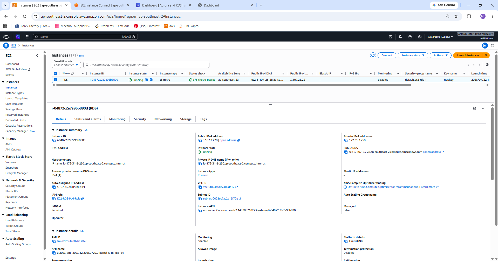

---

## 2️⃣ IAM Role Attached

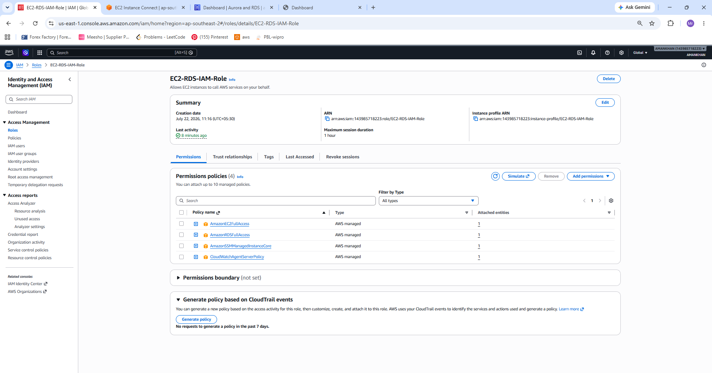

---

## 3️⃣ RDS Database

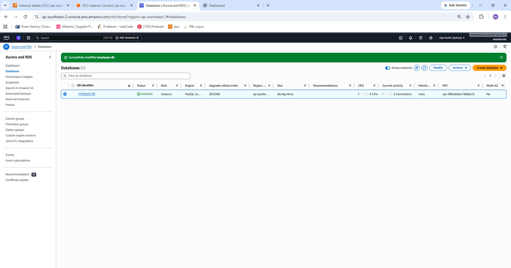

---

## 4️⃣ RDS Master Credentials

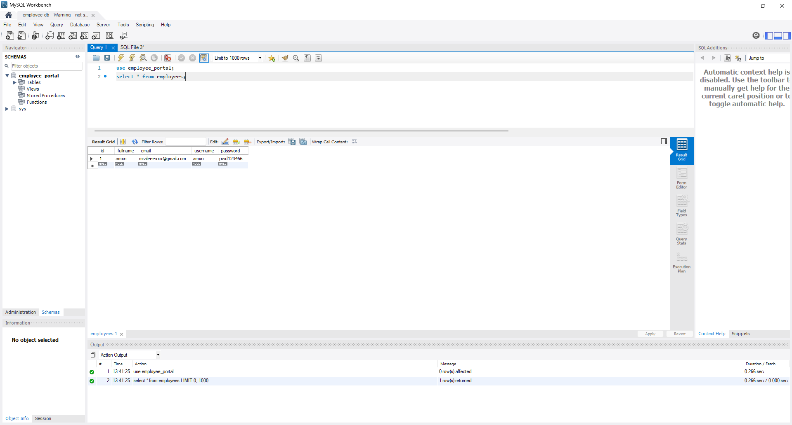

---

## 5️⃣ Database Details

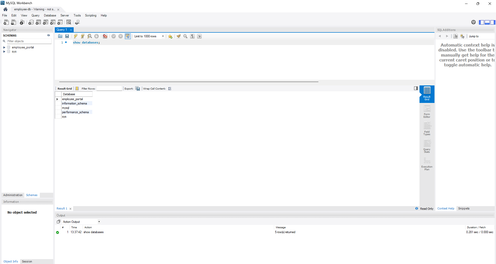

---

## 6️⃣ MySQL Workbench Home

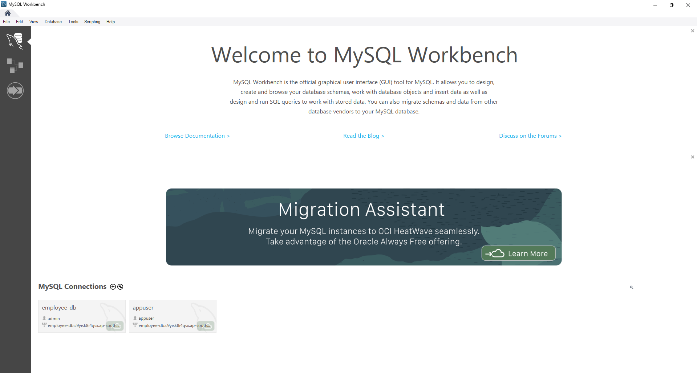

---

## 7️⃣ MySQL Workbench Connection

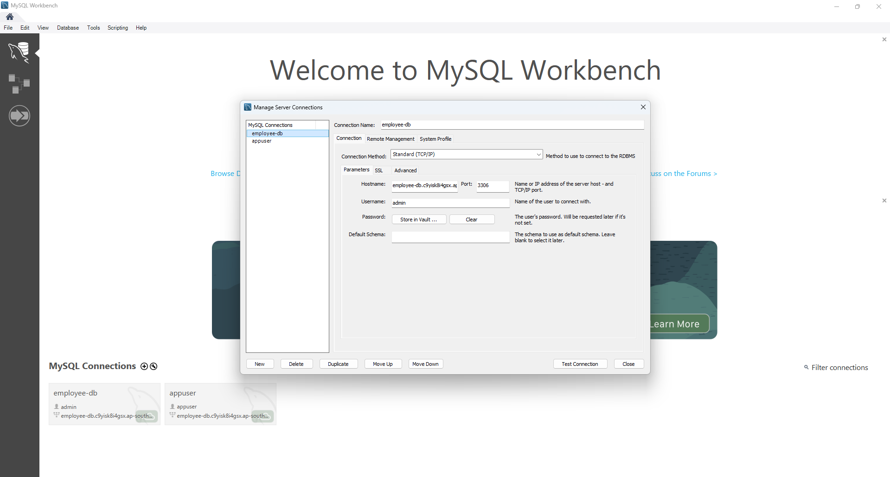

---

## 8️⃣ Successful Database Connection

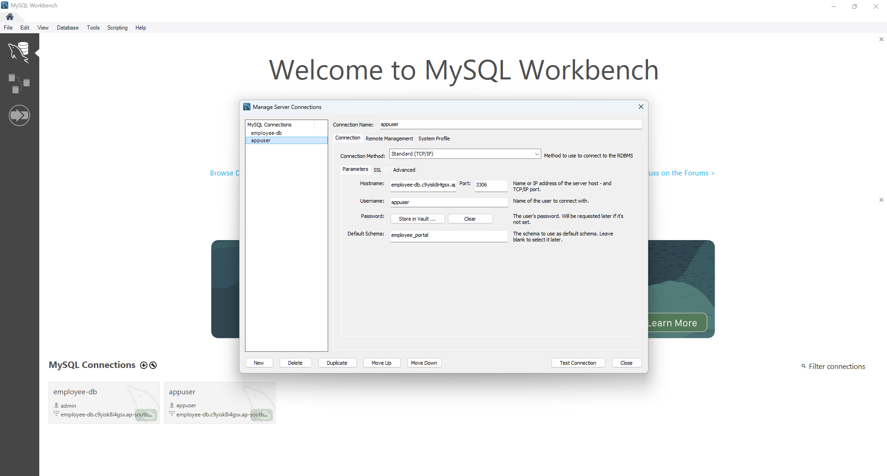

---

## 9️⃣ CloudWatch Metrics

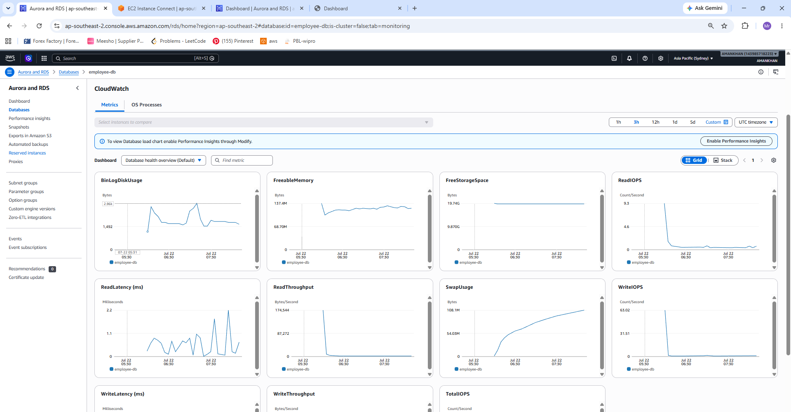

---

## 🔟 Employee Login Page

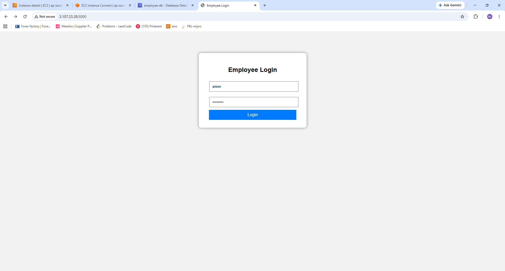

---

## 1️⃣1️⃣ Successful Login

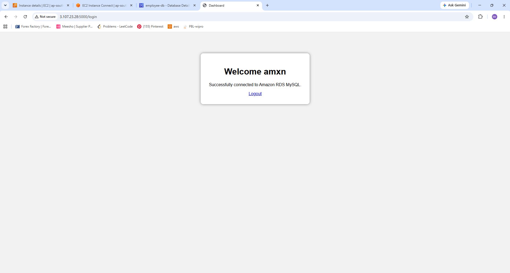

---

# ▶️ Run the Application

Clone the repository

```bash
git clone https://github.com/amn-khn/AWS-RDS-Employee-Portal.git
```

Go to the project

```bash
cd AWS-RDS-Employee-Portal
```

Create Virtual Environment

```bash
python3 -m venv venv
```

Activate

Linux

```bash
source venv/bin/activate
```

Windows

```bash
venv\Scripts\activate
```

Install Dependencies

```bash
pip install -r requirements.txt
```

Run

```bash
python app.py
```

Open

```text
http://<EC2_PUBLIC_IP>:5000
```

---

# 🔒 Security Best Practices

- IAM Role attached to EC2 instead of storing AWS credentials.
- Dedicated MySQL application user.
- Security Groups restrict access to MySQL.
- Parameterized SQL queries prevent SQL Injection.
- Separate application and database layers.

---

# 📚 Learning Outcomes

- Amazon EC2 Deployment
- Amazon RDS MySQL
- IAM Role Management
- MySQL Workbench
- Flask Application Deployment
- Python Database Connectivity
- Security Groups Configuration
- SQL Authentication
- Cloud Architecture Fundamentals

---

# 🚀 Future Improvements

- Password Hashing
- User Registration
- Session Management
- HTTPS using ACM
- Nginx + Gunicorn Deployment
- AWS Secrets Manager Integration
- Docker Support

---

# 👨‍💻 Author

**MOHAMMED AMANKHAN**

GitHub: https://github.com/amn-khn

---

# 📄 License

This project is licensed under the **MIT License**.

Copyright (c) 2026 **MOHAMMED AMANKHAN**

Permission is hereby granted, free of charge, to any person obtaining a copy of this software and associated documentation files (the "Software"), to deal in the Software without restriction, including without limitation the rights to use, copy, modify, merge, publish, distribute, sublicense, and/or sell copies of the Software.

---

# ⭐ If you found this project helpful, don't forget to Star ⭐ the repository!
